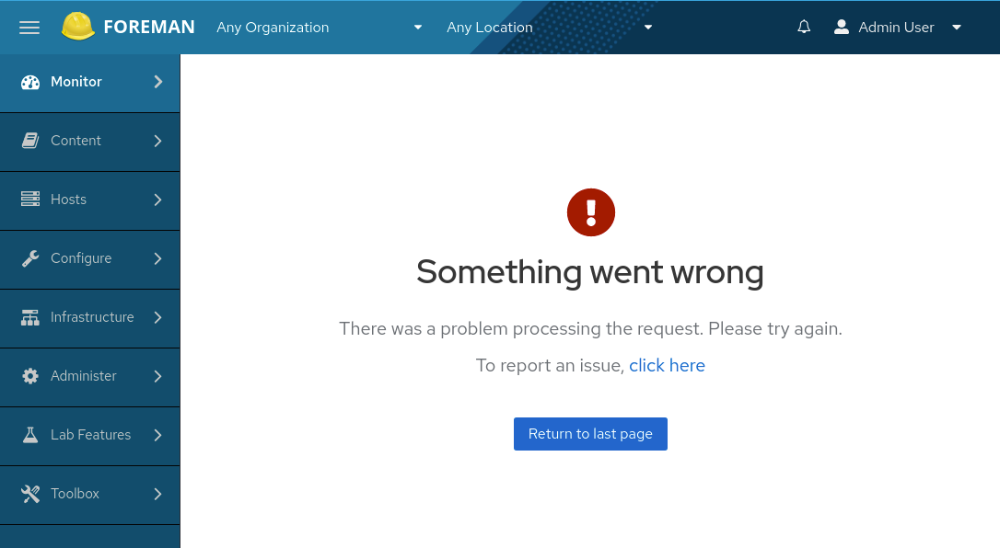

## error boundary

### 예시

결제 처리 컴포넌트
```typescript
import React, { useState } from 'react';
import { ErrorBoundary, FallbackProps } from 'react-error-boundary';

interface PaymentProcessorProps {
  amount: number;
  onSuccess: (result: any) => void;
}

const PaymentProcessor: React.FC<PaymentProcessorProps> = ({ amount, onSuccess }) => {
  const [processing, setProcessing] = useState<boolean>(false);

  const handlePayment = async () => {
    setProcessing(true);
    try {
      const response = await fetch('https://api.example.com/process-payment', {
        method: 'POST',
        body: JSON.stringify({ amount }),
        headers: { 'Content-Type': 'application/json' }
      });
      if (!response.ok) throw new Error('Payment processing failed');
      const result = await response.json();
      onSuccess(result);
    } catch (error) {
      throw error;
    } finally {
      setProcessing(false);
    }
  };

  return (
    <button onClick={handlePayment} disabled={processing}>
      {processing ? '처리 중...' : `${amount}원 결제하기`}
    </button>
  );
}

const PaymentErrorFallback: React.FC<FallbackProps> = ({ error, resetErrorBoundary }) => {
  return (
    <div role="alert">
      <p>결제 처리 중 오류가 발생했습니다:</p>
      <pre>{error.message}</pre>
      <button onClick={resetErrorBoundary}>다시 시도</button>
    </div>
  );
}

interface PaymentProcessorWrapperProps {
  amount: number;
  onSuccess: (result: any) => void;
}

const PaymentProcessorWrapper: React.FC<PaymentProcessorWrapperProps> = ({ amount, onSuccess }) => {
  return (
    <ErrorBoundary
      FallbackComponent={PaymentErrorFallback}
      onReset={() => {
        // 결제 상태 초기화 로직
      }}
    >
      <PaymentProcessor amount={amount} onSuccess={onSuccess} />
    </ErrorBoundary>
  );
}

export default PaymentProcessorWrapper;
```

에러 바운더리는 에러를 해결하는 것이 아니라 에러를 더 효과적으로 처리하고 표시하는 방법일 뿐입니당.

<br/>
<br/>

### 장점

- 에러 격리: 에러가 발생한 컴포넌트를 격리하여 전체 애플리케이션이 중단되는 것을 방지합니다. <br/>
사용자 경험 개선: 전체 애플리케이션이 중단되는 대신 부분적인 기능 손실만 발생하도록 합니다.

React 애플리케이션은 컴포넌트 트리로 구성되는데, 에러 바운더리는 이 트리 구조의 특정 부분을 감싸는 특별한 컴포넌트로 작동합니다.

에러 바운더리 컴포넌트는 React의 라이프사이클 메서드인 componentDidCatch나 static getDerivedStateFromError를 구현하는데 <br/> 이 메서드들은 자식 컴포넌트에서 발생한 JavaScript 에러를 '캐치'할 수 있습니다.

에러가 발생하면, 에러 바운더리는 해당 에러를 캐치하고 에러가 상위 컴포넌트로 전파되는 것을 막습니다. <br/>
이로 인해 에러의 영향 범위가 해당 에러 바운더리 내부로 제한됩니다. <br/>
(에러 바운더리 외부의 컴포넌트들은 정상적으로 계속 작동합니다.)

에러를 캐치한 후, 에러 바운더리는 에러가 발생한 컴포넌트 대신 미리 정의된 폴백(fallback) UI를 렌더링합니다.


<br/>

- 폴백 UI 제공: 에러가 발생했을 때 사용자에게 친화적인 대체 UI를 표시합니다. <br/>
에러 복구 메커니즘: 일부 구현에서는 에러 상태를 리셋하고 컴포넌트를 다시 시도할 수 있는 기능을 제공합니다.



<br/>

- 에러 로깅: 발생한 에러에 대한 정보를 로깅하여 디버깅을 용이하게 합니다.

다음은 프론트엔드 개발자들이 주로 사용하는 로깅 도구 <br/>
1) 브라우저 개발자 도구 콘솔 <br/>
2) Sentry <br/>
3) LogRocket <br/>
4) New Relic Browser 

이 중에서 Sentry(에러트래킹을 위한 Saas 서비스)가 가장 널리 사용되는 도구. <br/>
다음처럼 에러 바운더리 자체를 sentry 라이브러리를 사용해 감싸서 사용합니다.

```typescript
import React from 'react';
import * as Sentry from "@sentry/react";

const FallbackComponent = ({error}) => (
  <div>An error occurred: {error.message}</div>
);

const MyApp = () => (
  <Sentry.ErrorBoundary fallback={FallbackComponent} showDialog>
    <App />
  </Sentry.ErrorBoundary>
);

export default MyApp;
```
[Sentry 라이브러리의 실질적 사용과 관련한 정보](https://www.hojunin.com/contents/sentry)를 참조하세요.


<br/>
<br/>

### 한계

- 이벤트 핸들러 내부의 에러를 잡지 못합니다.

이벤트 핸들러는 React의 렌더링 생명주기 외부에서 실행되기 때문에 에러 바운더리의 범위를 벗어납니다. <br/>
일반적인 JavaScript try/catch 구문을 사용하여 해결할 수 있습니다.

<br/>

- 비동기 코드(예: setTimeout 콜백)에서 발생하는 에러를 잡지 못합니다.

비동기 작업은 컴포넌트의 렌더링 이후에 실행되므로 에러 바운더리의 범위를 벗어나기 때문입니다. <br/>
react-error-boundary 라이브러리의 useErrorHandler 훅을 사용하여 극복할 수 있습니다.

```typescript
import React, { useState, useEffect } from "react";
import { ErrorBoundary, useErrorHandler } from "react-error-boundary";

function ErrorFallback({ error, resetErrorBoundary }) {
  return (
    <div role="alert">
      <p>에러가 발생했습니다:</p>
      <pre>{error.message}</pre>
      <button onClick={resetErrorBoundary}>다시 시도</button>
    </div>
  );
}

function AsyncComponent() {
  const [data, setData] = useState(null);
  const handleError = useErrorHandler();

  useEffect(() => {
    const fetchData = async () => {
      try {
        const response = await fetch('https://api.example.com/data');
        if (!response.ok) {
          throw new Error('데이터를 불러오는데 실패했습니다');
        }
        const result = await response.json();
        setData(result);
      } catch (error) {
        handleError(error);
      }
    };

    fetchData();
  }, [handleError]);

  if (data === null) {
    return <div>로딩 중...</div>;
  }

  return <div>{data}</div>;
}

function App() {
  return (
    <ErrorBoundary FallbackComponent={ErrorFallback}>
      <AsyncComponent />
    </ErrorBoundary>
  );
}

export default App;
```

<br/>

- 서버 사이드 렌더링 중 발생하는 에러를 잡지 못합니다.

서버 사이드 렌더링은 React의 클라이언트 사이드 생명주기와 다른 환경에서 실행되므로 일반적인 에러 바운더리로 잡을 수 없습니다. <br/>
서버 사이드에서 별도의 에러 처리 로직을 구현합니다. <br/>
(Next.js와 같은 프레임워크를 사용하는 경우, 해당 프레임워크에서 제공하는 서버 사이드 에러 처리 메커니즘을 활용)


<br/>
<br/>